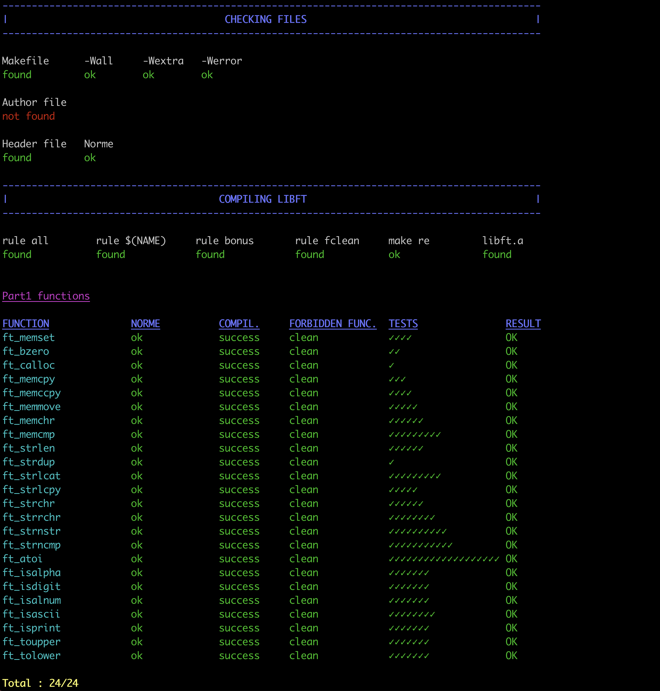
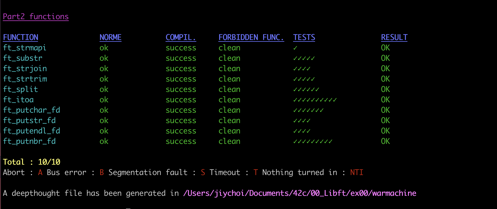
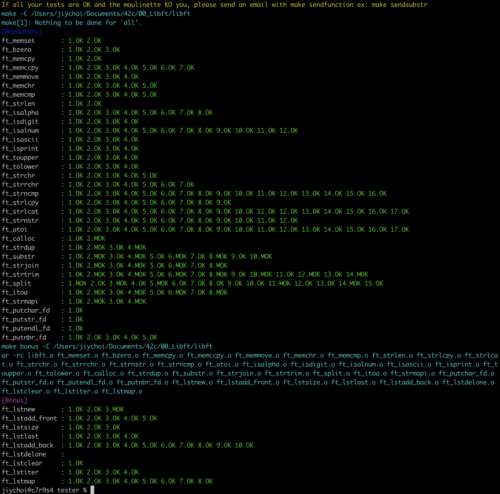

# Libft 함수 리스트
Libft 함수 리스트 및 설명
- [x] libftest 100점
- [x] Warmachine 100점 (Bonus 제외)
- [x] Unit-test 100점
- [x] Libft Tester 100점

 

## 주의사항
- Part 1의 Libc 함수들은 동작이 완벽하게 원본 함수와 동일해야 한다. Segmentation Fault마저도!
- Part 2부터는 Segmentation Fault에 대한 대비를 자유롭게 해주어도 됨 (널 포인터 가드 등)
	- 허나 프로텍트를 걸어주고 싶다면 모든 Part2, PartB 함수들에 대하여 일관성 있게 걸어주는 것이 포인트
	- 이 부분에서 디펜스가 난감해질 수 있다
- Part 1, Part 2, Part B에서 구현하라고 요구하진 않지만, 개인적으로 구현해서 쓰고싶은 함수가 있다면 자유롭게 헤더에 추가해도 된다
	- 나는 Split을 위해 strndup (n개만큼만 새로운 메모리영역에 복사) 을 구현해줬음
- split, lstmap 구현 시 포인터 해제를 해 주어야 누수가 발생하지 않는다
	- 이후에도 계속 해당 함수들을 쓸 일이 생기는데, 프로세스가 종료될 수 없는 특별한 경우에는 누수를 꼭 잡아주어야 함

 

## Part 1 - Libc functions
- [Part 1-0 : Memory Functions](mds/part1-0.md)
- [Part 1-1 : String Functions](mds/part1-1.md)
- [Part 1-2 : Char Determination Functions](mds/part1-2.md)
- [Part 1-3 : Memory Allocation Functions](mds/part1-3.md)

## Part 2 - Additional functions
- [Part 2-0 : Additional String Management Functions](mds/part2-0.md)
- [Part 2-1 : Additional File Write Functions](mds/part2-1.md)

## Part B - Bonus part (List Manipulation Functions)
- [Part b](mds/partb.md)

 

## Test Shell images
### Libftest

### War Machine (Bonus not working!)

### Unit-Test

### Libft Tester

