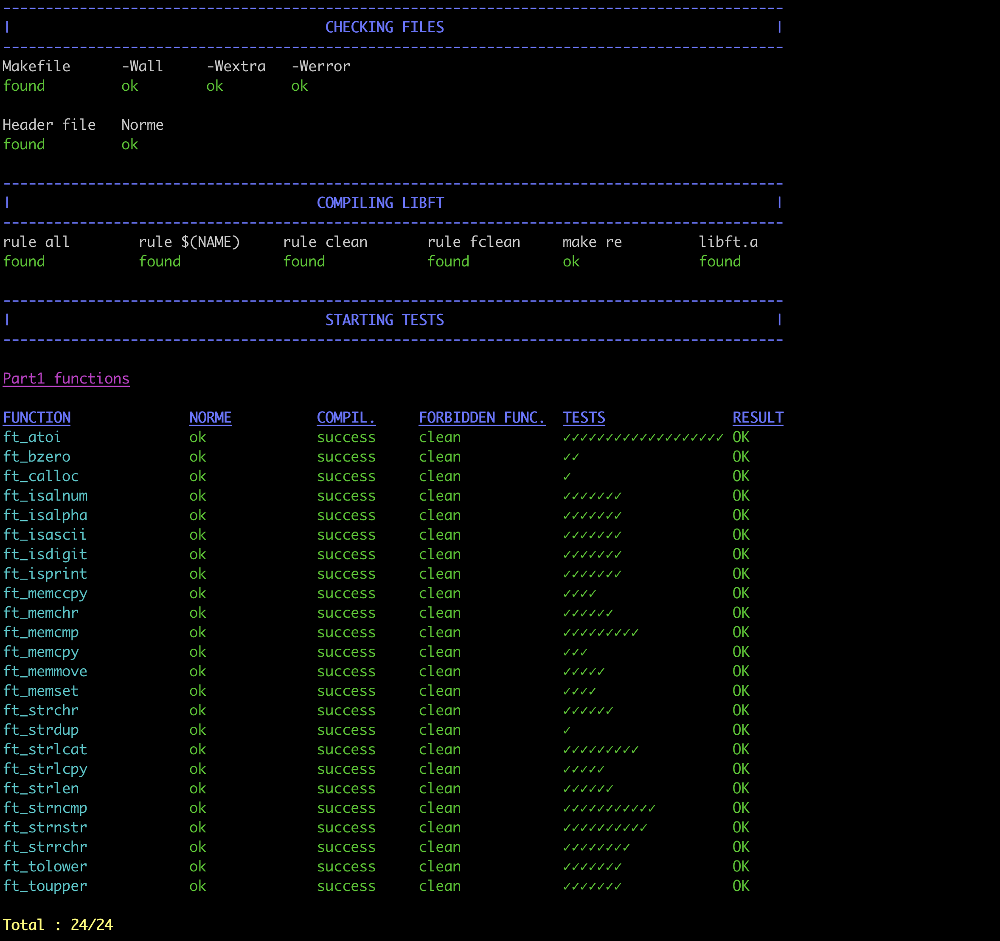
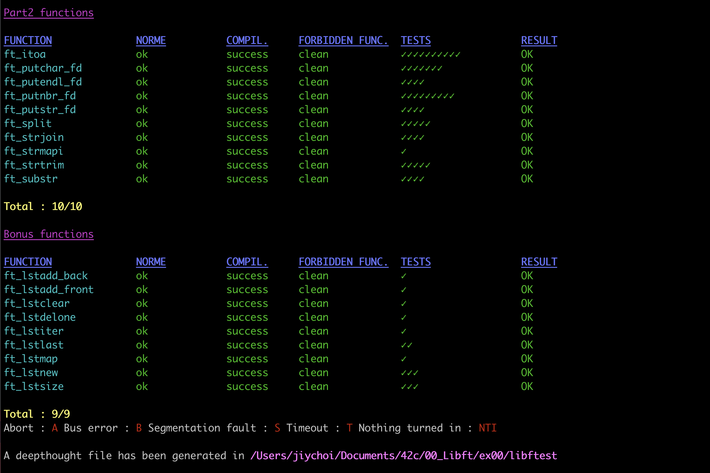

# Libft 함수 리스트
Libft 함수 리스트 및 설명

## Part 1 - Libc functions
[Part 1-0 : Memory Functions](mds/part1-0.md)  
[Part 1-1 : String Functions](mds/part1-1.md)  
[Part 1-2 : Char Determination Functions](mds/part1-2.md)  
[Part 1-3 : Memory Allocation Functions](mds/part1-3.md)  

## Part 2 - Additional functions
[Part 2-0 : Additional String Management Functions](mds/part2-0.md)  
[Part 2-1 : Additional File Write Functions](mds/part2-1.md)  

## Part B - Bonus part (List Manipulation Functions)
[Part b](mds/partb.md)

## Test Shell images
### Libftest

