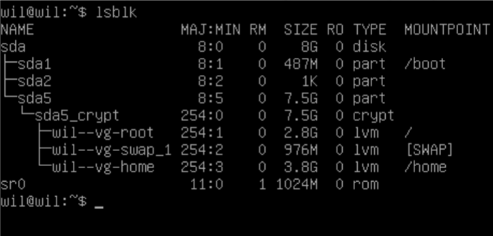
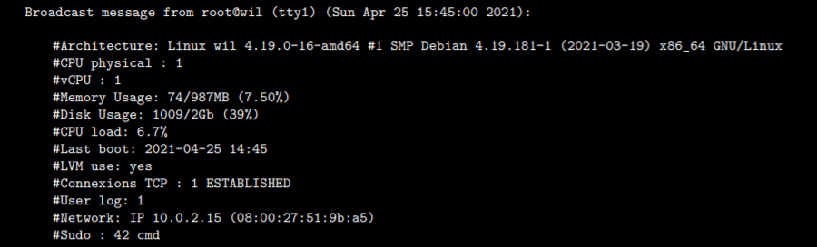
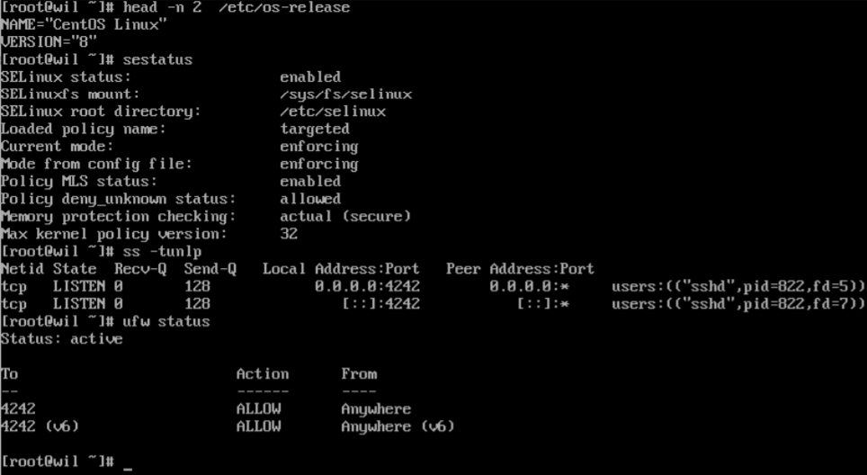

# **Born2beRoot**

_요약: 이 문서는 시스템 관리에 대한 과제를 담고 있습니다._

<br>

# **Contents**

| Chapter | Contents                                         | page |
| :-----: | :----------------------------------------------- | :--: |
|    1    | [**Preamble**](#Chapter-1)                       |  2   |
|    2    | [**Introduction**](#Chapter-2)                   |  3   |
|    3    | [**Gereral guidelines**](#Chapter-3)             |  4   |
|    4    | [**Mandatory part**](#Chapter-4)                 |  5   |
|    5    | [**Bonus part**](#Chapter-5)                     |  10  |
|    6    | [**Submission and peer-evaluation**](#Chapter-6) |  12  |

<br><br>

# **Chapter 1**

## Preamble

<br>


```
YOU CAN DO ANYTHING YOU WANT TO DO
네가 하고 싶어하는 모든 것을 할 수 있단다

(VIRTUAL MACHINE)
(가상 머신)

THIS IS YOUR WORLD
여긴 네 세상이니까!
```

<br>

# **Chapter 2**

## Introduction

<br>

이 프로젝트는 여러분을 멋진 가상화 (Virtualization)의 세계로 안내해 드릴 것을 목표로 합니다.

여러분은 특정한 절차를 따라 여러분의 첫 번째 `VirtualBox` (만약 `VirtualBox`를 사용할 수 없다면, `UTM`) 머신을 만들 것입니다. 그리고, 프로젝트의 끝에선 여러분만의 운영 체제를 엄격한 규칙을 따르면서 설정할 수 있게 될 겁니다.

<br>

# **Chapter 3**

## General guidelines

<br>

- `Virtualbox`의 사용은 필수적입니다.

- 과제 제출 시에는, git 저장소 (repository) 의 루트에 `signature.txt`만 제출하면 됩니다. 해당 파일에는 반드시 여러분이 만든 머신의 디스크 서명 (Disk Signature) 을 붙여 넣어야 합니다. 더 많은 정보는 [**Submission and peer-evaluation**](#Chapter-6) 챕터를 참고하세요.

<br>

# **Chapter 4**

## Mandatory part

<br>
이 프로젝트는 다음과 같은 규칙을 따르면서 첫 번째 서버를 설정하기를 요구합니다.

```
⚠️
서버를 설정하는 문제이기 때문에, 여러분은 최소한 적은 개수의 서비스를 설치해야 합니다. 이러한 이유 때문에, 그래픽 인터페이스는 사용되지 않습니다. X.org나 다른 비슷한 그래픽 서버를 설치하는 것도 금지합니다. 사용할 경우, 점수는 0점이 될 것입니다.
```

<br>

여러분은 사용할 운영체제로 `Debian` 최신 stable 버전 (테스팅 / unstable 버전은 사용하지 마세요) 도는 `CentOS` 최신 stable 버전 중 하나를 선택할 수 있습니다. 만약 시스템 관리가 처음이라면, `Debian`을 적극 추천합니다.

```
ℹ️
CentOS 설정은 비교적 까다롭습니다. 그렇기 때문에, 여러분은 굳이 KDump까지 설정하실 필요가 없습니다. 허나, SELinux는 시작 시에 구동되어야 하고, 프로젝트의 요구에 맞추어 설정되어 있어야 합니다. Debian의 AppArmor 또한 시작 시에 구동되어야 합니다.
```

<br>

여러분은 `LVM`을 이용하여 최소 2개의 암호화된 파티션을 생성해야 합니다. 아래의 그림은 그 예시입니다 :



```
ℹ️
동료평가 시에는, 여러분이 선택한 운영체제에 대해 몇 가지 질문을 받을 것입니다. 예를 들면, 여러분은 aptitude와 apt의 차이점을 알고 있어야 하고, SELinux 또는 AppArmor이 무엇인지 알고 있어야 합니다. 요약하자면, 여러분이 사용하는 것에 대해 충분히 공부하세요!
```

<br>

`SSH` 서비스는 4242 포트에서만 작동해야 합니다. 보안상의 문제 때문에, `SSH`를 이용한 root 연결을 허용하면 절대 안 됩니다.

```
ℹ️
동료평가에서, 새로운 계정을 생성하여 SSH의 동작을 테스트할 것입니다. 그러므로 여러분은 SSH가 어떻게 동작하는 지 잘 알아 두어야 합니다.
```

<br>

여러분은 `UFW` 방화벽을 이용하여 운영체제를 설정해야 하므로, 오직 4242 포트만 열어 두어야 합니다.

```
ℹ️
여러분의 가상 머신을 실행시켰을 때, 방화벽이 반드시 활성화되어야 합니다. CentOS는 기본 방화벽 대신 UFW를 사용하여야 합니다. 이를 설치하기 위해선 DNF가 필요할 것입니다.
```

<br>

- 여러분의 가상머신의 `호스트명` 은 로그인 아이디 뒤에 42를 붙인 형식이 되어야 합니다. (예를 들면, wil42)

- 여러분은 강한 비밀번호 체계를 도입해야 합니다.

- 여러분은 엄격한 규칙 하에 `sudo`를 설치하고 설정하여야 합니다.

- 루트 사용자 외에도, 여러분의 로그인 아이디를 유저명으로 사용하는 유저가 있어야 합니다.

- 이 유저는 반드시 `user42` 와 `sudo` 그룹에 포함되어야 합니다.

```
ℹ️
동료평가 시에, 여러분은 새로운 유저를 생성 후 그룹에 배정해 볼 것입니다.
```

<br>

강한 비밀번호 체계를 도입하기 위해, 여러분은 다음과 같은 요구 사항에 응해야 합니다 :

- 여러분의 비밀번호는 30일마다 소멸되어야 합니다.

- 비밀번호 변경을 위해 기다려야 하는 기간은 최소 이틀로 설정되어야 합니다.

- 유저는 비밀번호 소멸 7일 전에 경고 메시지를 받아야 합니다.

- 비밀번호는 최소 10글자 이상이 되어야 하고, 대문자와 숫자를 포함하여야 하며, 같은 글자가 3번 이상 연속되면 안 됩니다.

- 비밀번호에 유저명이 포함되면 안 됩니다.

- 비밀번호는 이전 비밀번호에 포함되지 않는 문자를 최소 7개 이상 포함하여야 합니다.

- 당연히, 루트 권한 비밀번호 또한 해당 규칙을 따라야 합니다.

```
⚠️
설정 파일들을 모두 세팅한 후, 여러분은 루트 계정을 포함한 가상 머신 내의 모든 계정에 대한 비밀번호를 바꿔주어야 합니다.
```

<br>

강한 `sudo` 그룹 설정을 도입하기 위해, 여러분은 다음과 같은 요구 사항에 응해야 합니다 :

- `sudo` 인증 시에는 비밀번호가 틀렸을 때 3번의 기회만이 주어져야 합니다.

- `sudo` 권한 사용 중에는 비밀번호가 틀렸을 때 여러분이 설정한 오류 메시지가 출력되어야 합니다.

- `sudo` 권한을 이용하여 수행한 명령어들은 입출력 모두 기록되어야 합니다. 해당 기록은 log 파일로 /var/log/sudo/ 폴더에 저장되어야 합니다.

- 보안상의 문제 때문에, TTY 모드는 활성화되어 있어야 합니다.

- 마찬가지로 보안상 문제 때문에, `sudo` 권한으로 이용할 수 있는 폴더 경로는 반드시 제한되어야 합니다.
  > 예시 :
  > `/usr/local/sbin:/usr/local/bin:/usr/sbin:/usr/bin:/sbin:/bin:/snap/bin`

<br>

마지막으로, 여러분은 `monitoring.sh` 라는 간단한 스크립트를 작성하여야 합니다. 이것은 `bash` 환경에서 작동하여야 합니다.

서버가 시작될 때, 스크립트는 모든 터미널에 몇 가지 정보들을 10분에 한 번씩 보여줘야 합니다. (`wall`을 참고하세요) 배너는 선택사항이고, 오류가 보이면 안 됩니다.

여러분의 스크립트는 반드시 다음과 같은 정보들을 포함하여 보여주어야 합니다 :

- 여러분이 사용하는 운영체제의 아키텍쳐와 커널 버전

- 물리 프로세서의 개수

- 가상 프로세서의 개수

- 서버 내에서 사용가능한 램과 가동률 (utilization rate) 을 백분율로 표시

- 서버 내에서 사용가능한 메모리와 가동률을 백분율로 표시

- 프로세서들의 가동률을 백분율로 표시

- 마지막 부팅 시간과 날짜

- LVM이 활성화 되었는지 여부

- 활성화된 연결의 수

- 서버를 사용하고 있는 유저의 수

- 서버의 IPv4 주소와 MAC (Media Access Control = 매체 접근 제어) 주소

- Sudo로 실행된 커맨드의 수

```
ℹ️
동료평가 시에, 여러분은 이 스크립트의 동작 방식을 질문받을 것입니다. 또한, 스크립트를 수정하지 않고도 중단시킬 수 있어야 합니다. 'cron'을 검색해 보세요.
```

<br>

이것은 스크립트의 동작 예시입니다 :



<br>

아래의 두 명령어로 여러분은 이번 과제의 요구사항을 체크할 수 있습니다.

`CentOS`



`Debian`


<br>

# **Chapter 5**

## Bonus part

<br>

보너스 목록:

- 파티션을 제대로 구성하여 아래와 같은 구조와 비슷하게 만들어 보세요 :


- 다음의 서비스를 이용하여 동작하는 Wordpress 웹사이트를 설정해 보세요 : lighttpd, MariaDB, PHP

- 여러분이 유용하다고 판단되는 서비스를 사용해 보세요. (NGINX, Apache2 제외!!!) 동료평가 시에, 사용에 대한 합당한 이유를 제시하여야 합니다.

```
ℹ️
보너스를 수행하기 위해선, 추가적인 서비스를 구성하게 될 수도 있습니다. 이러한 경우엔, 여러분이 필요한 포트를 더 열어도 괜찮습니다. 당연히 UFW 룰은 제대로 적용되어야 해요.
```

```
⚠️
보너스 파트는 필수 파트 (Mandatory part)가 완벽하게 구현되었을 때만 고려됩니다. '완벽하다' 의 의미는 필수 파트가 전체적으로 다 완료되었고, 오류 및 오작동 없이 잘 동작해야 한다는 뜻입니다. 만약 필수 요구 사항을 전부 통과하지 못 했다면, 보너스는 아예 채점되지 않을 것입니다.
```

<br>

# **Chapter 6**

## Submission and peer-evaluation

<br>

과제 제출 시에는, git 저장소 (repository) 의 루트에 `signature.txt`만 제출하면 됩니다. 해당 파일에는 반드시 여러분이 만든 머신의 디스크 서명 (Disk Signature) 을 붙여 넣어야 합니다. 디스크 서명을 얻으려면, 우선 기본 설치 폴더를 열어야 합니다. (여러분이 VM들을 저장한 폴더입니다)

- Windows : `%HOMEDRIVE%%HOMEPATH%\VirtualBox VMs\`

- Linux : `~/VirtualBox VMs/`

- MacOS : `~/VirtualBox VMs/`

<br>

그리고, 가상머신 내의 "`.vdi`" 파일로부터 `sha1` 포맷으로 구성된 서명을 가져와야 합니다. 아래는 `centos_serv.vdi` 파일로부터 서명을 가져오는 3가지 명령어 예시입니다 :

- Windows : `certUtil -hashfile centos_serv.vdi sha1`

- Linux : `sha1sum centos_serv.vdi`

- MacOS : `shasum centos_serv.vdi`

이것은 여러분이 얻어야 할 결과물 예시입니다 :

`6e657c4619944be17df3c31faa030c25e43e40af`

```
ℹ️
첫 평가 후 여러분의 가상머신 서명이 변경될 가능성이 있습니다. 이 현상을 해결하려면, 가상머신을 복사하거나 상태 저장 (save state) 을 사용하세요.
```

```
⚠️
당연히 가상머신 전체를 git 저장소에 올리는 것은 금지됩니다! 동료평가 시에는, 제출한 signature.txt와 가상머신의 서명이 비교될 것입니다. 두 개가 같지 않을 경우, 0점 처리됩니다.
```
