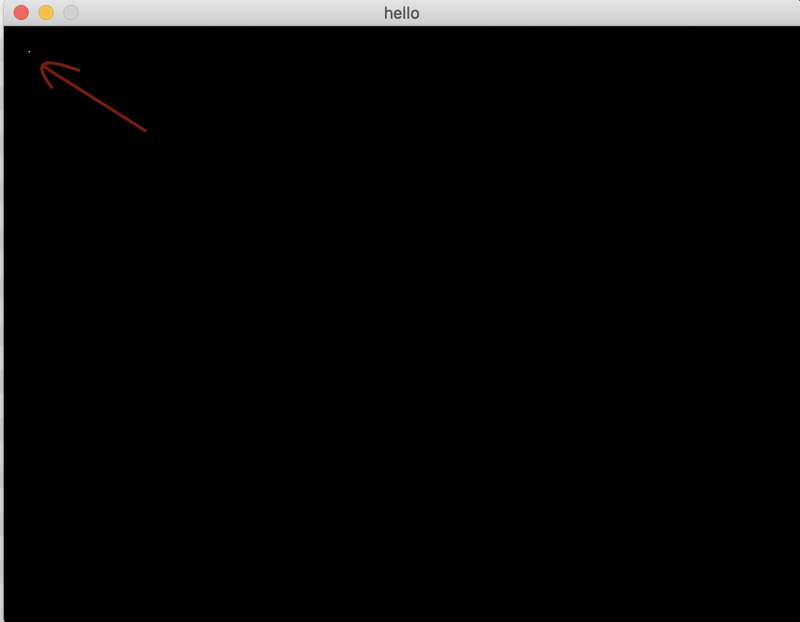

# Minilibx

화면에 그림을 그리고, 이벤트를 제어할 수 있는 자체 라이브러리

컴파일 커맨드 : `gcc -I /usr/local/include main.c -L /usr/local/lib/ -lmlx -framework OpenGL -framework AppKit`

## mlx_new_window

- 화면 다루기

- **void \* mlx_new_window(void \*mlx_ptr, int size_x, int size_y, char *title);**

- `void *mlx_ptr`은 `mlx_init()`으로 그래픽 서버와 연결한 후 이를 판단하는 포인터

- `int size_x, int size_y`는 화면 가로세로 크기

- `char *title`은 화면의 제목

- 반환값은 void * 타입으로, 화면을 초기화한 포인터가 들어가기 때문에 화면에 좌표를 찍는 등 할 때 필요

## mlx_pixel_put

- 화면에 픽셀 찍기

- **void \* mlx_pixel_put(void \*mlx_ptr, void \*win_ptr, int x, int y, int color);**

- `void *mlx_ptr`은 mlx_new_window때와 마찬가지로 `mlx_init()` 시에 사용했던 포인터를 그대로 사용하면 된다

- `void *win_ptr`은 `mlx_new_window()`의 출력값으로 나왔던 보이드 포인터

- `int x, int y`는 좌표

- `int color`은 색상 지정 (1바이트 R, 1바이트 G, 1바이트 B #RRGGBB)

- 작은 점을 찍은 사진

	

## mlx_key_hook

- 키보드 처리

- **int mlx_key_hook (void \*win_ptr, int (*funct_ptr)(), void \*param);**

- win_ptr은 다른 함수와 마찬가지로 new_window를 통해 연 창의 포인터 (이를 이용하여 어떤 창에 결과값을 표시할 것인지 결정)

- funct_ptr은 특정 키를 눌렀을 때 mlx_loop 측에서 동작시킬 함수

- *param은 funct_ptr에 넘겨줄 인자 포인터 (mlx와는 크게 관계없음)

- funct_ptr에 넘겨줄 함수포인터의 첫 번째 인자값을 int key로 하면, 입력한 키값이 자동으로 해당 인자로 들어간다 (찍어보면 알 수 있음)

## mlx_new_image

- 이미지 처리하기

## mlx_loop

- 마우스 및 키보드 제어

- mlx 라이브러리를 다룰 때 마지막에 무조건 필요함

- 창 내에서 이뤄지는 각종 이벤트들을 제어하기 때문에, 매우 중요
